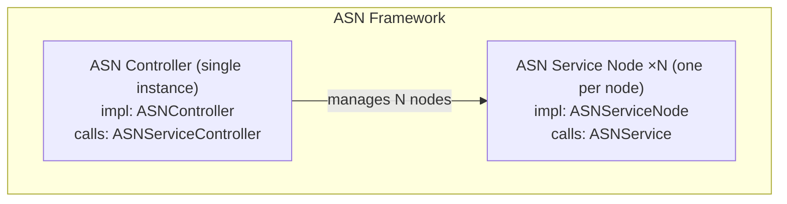
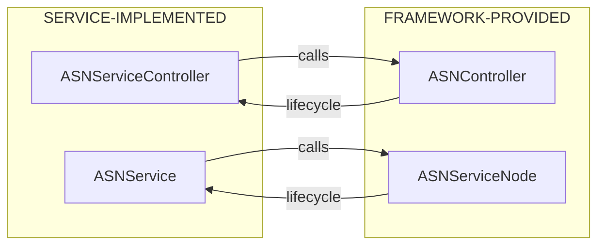
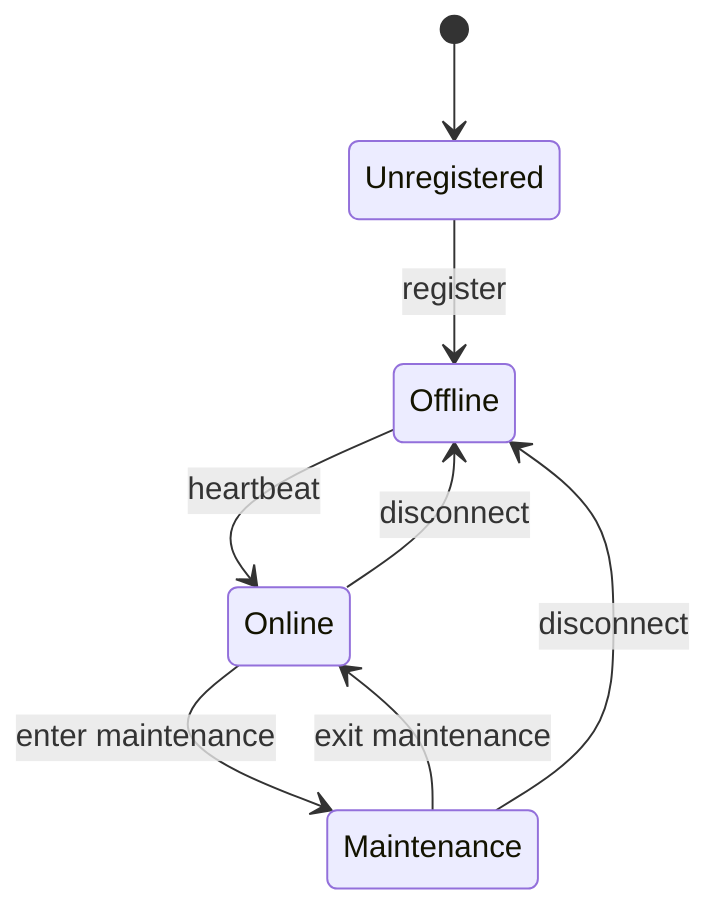
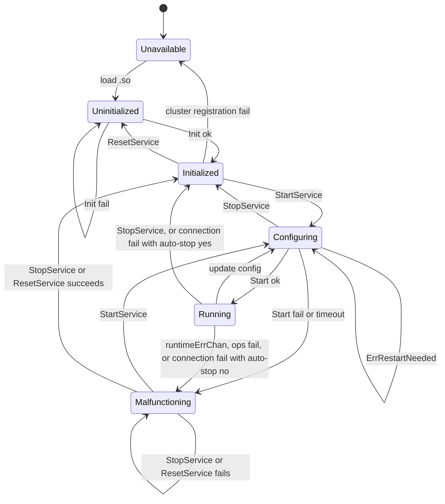
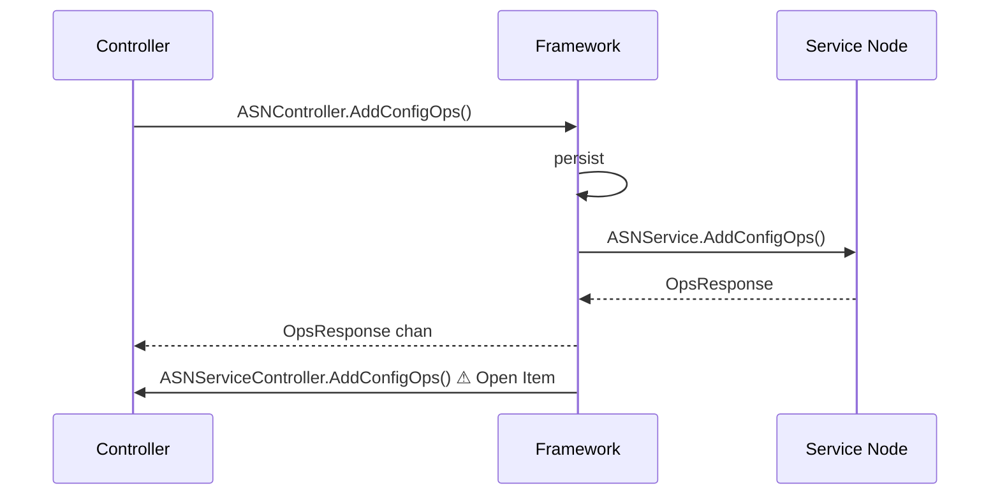

# ASN Service API Design

> Interface contract between the ASN framework and service implementations.  
> Covers: call sequencing, re-entrancy, state machines, and implementation obligations.
>
> For per-method details, see inline comments in the respective package files.

---

## Open Items

Issues not yet resolved in the current API design. These must be decided before the affected surfaces are considered stable.

| # | Area | Item | Status |
|---|---|---|---|
| 1 | §5.1 Config op callbacks | Whether `ASNServiceController.AddConfigOps / UpdateConfigOp / DeleteConfigOps` are invoked at all is under discussion. The alternative: drop controller-side callbacks entirely and let config op errors propagate from the node directly to `Malfunctioning`, consistent with how `Start()` errors are handled. | Under discussion |

---

## Table of Contents

1. [Architecture Overview](#1-architecture-overview)
2. [Package Organization](#2-package-organization)
3. [Object Relationships and Ownership](#3-object-relationships-and-ownership)
4. [State Management](#4-state-management)
5. [Controller Side — `capi`](#5-controller-side--capi)
6. [Service Node Side — `snapi`](#6-service-node-side--snapi)
7. [Config Ops](#7-config-ops)
8. [Ops Commands](#8-ops-commands)
9. [Cross-Service Data Sharing](#9-cross-service-data-sharing)
10. [IAM](#10-iam)
11. [Subscription](#11-subscription)
12. [Implementation Checklist](#12-implementation-checklist)

---

## 1. Architecture Overview

ASN is a distributed control-plane framework with a fixed topology: **one Controller** (management plane) paired with **N Service Nodes** (data plane). Services are loaded as **`.so` shared libraries** at runtime.



The framework owns all topology (networks, nodes, groups); services observe and annotate it. Services do not communicate through the framework's network layer — intra-node cross-service data exchange uses the Shared Data mechanism (§9).

---

## 2. Package Organization

| Package | Path Suffix | Role |
|---|---|---|
| `capi` | `/controller` | Controller-side interfaces and structs |
| `snapi` | `/servicenode` | Service-node-side interfaces and structs |
| `commonapi` | `/common` | Shared enums, structs, DB/log abstractions |
| `iam` | `/iam` | IAM interface |
| `subscription` | `/subscription` | Subscription / IAP interface |
| `log` | `/log` | Structured logger interface |

---

## 3. Object Relationships and Ownership



| Interface | Implemented by | Consumed by |
|---|---|---|
| `ASNController` | Framework | `ASNServiceController` |
| `ASNServiceController` | Service | Framework |
| `ASNServiceNode` | Framework | `ASNService` |
| `ASNService` | Service | Framework |
| `iam.Instance` | Framework | `ASNServiceController` via `GetIAM()` |
| `subscription.Instance` | Framework | `ASNServiceController` via `GetSubscription()` |

Both `ASNServiceController` and `ASNService` expose a `StaticResource` sub-interface callable **before** `Init()`.

---

## 4. State Management

### Node States (`commonapi.NodeState`)

Framework-owned; services cannot set it directly.

| Value | Constant | Meaning |
|---|---|---|
| `0` | `NodeStateUnregistered` | Never successfully registered |
| `1` | `NodeStateOffline` | Registered but unreachable |
| `2` | `NodeStateOnline` | Connected and reachable |
| `3` | `NodeStateMaintenance` | Online but in maintenance mode |

#### Node State Transition Diagram



First-time registration always lands in `Offline`. Subsequent heartbeats drive transitions between `Offline`, `Online`, and `Maintenance`. The framework broadcasts every state change via `SubscribeNodeStateChanges()`.

#### Per-State Capabilities

| | Unregistered | Offline | Online | Maintenance |
|---|---|---|---|---|
| Register node | ✓ | — | — | — |
| Subscribe to node stream | — | ✓ (required) | — | — |
| Send service commands (Start / Stop / Reset) | — | — | ✓ | ✓ |
| Send service ops (`SendServiceOps`) | — | ✗ `NodeDisconnected` | ✓ | ✓ |
| Send config ops | — | ✗ `NodeDisconnected` | ✓ | ✓ |
| Receive `NodeStateChange` events | — | ✓ | ✓ | ✓ |

**Side effect on going `Offline`:** The framework immediately sets every loaded service on that node to `ServiceStateUnavailable`. All in-flight ops return `FrameworkErrNodeDisconnected`.

**`SubscribeNodeStateChanges`** — one-shot; a second call errors. Delivers an initial snapshot of all registered nodes, then incremental changes. The channel is never closed during normal operation.

`NodeStateChange` events carry the updated `NodeState`, current `ServiceState`, `FrameworkError` (non-nil on framework-level failures), and `ServiceError` (non-nil when the service reported an error during transition).

---

### Service States (`commonapi.ServiceState`)

Tracked independently per node. The framework owns all transitions; the service influences them only through return values from `Init()`, `Start()`, `Stop()`, and config op methods.

| Value | Constant | Meaning |
|---|---|---|
| `0` | `ServiceStateUnavailable` | `.so` not loaded on this node |
| `1` | `ServiceStateUninitialized` | `.so` loaded; `Init()` not yet called or failed |
| `2` | `ServiceStateInitialized` | `Init()` succeeded; waiting for start |
| `3` | `ServiceStateConfiguring` | `Start()` in progress (transient) |
| `4` | `ServiceStateRunning` | `Start()` succeeded; fully operational |
| `5` | `ServiceStateMalfunctioning` | Fatal error; must be explicitly restarted |

#### Service State Transition Diagram



**`Init()` is triggered automatically** by the framework after `.so` load. `Uninitialized` is a stable state only when `Init()` fails — `Init()` failure does **not** produce `Malfunctioning`; the service stays retryable via `ResetService`.

**Cluster mode registration**: In cluster mode, a freshly `INITIALIZED` service registers with the controller before the first `Start()`. Registration failure returns the service to `UNAVAILABLE`.

**Auto-start**: Services may be configured to start automatically after initialization (and registration in cluster mode), or wait for an explicit `StartService` command.

**Connection fail behavior** depends on the service's `auto-stop` configuration:
- `auto-stop=yes` — service cleanly stops → `INITIALIZED` (ready to restart on reconnection)
- `auto-stop=no` — service stays running; errors eventually surface via `runtimeErrChan` → `Malfunctioning`

**Reset (full reload)**: Unloads and reloads the service including a fresh `Init()`. The service briefly passes through `Uninitialized` then auto-transitions to `Initialized`.

#### Per-State Capabilities

The table below answers: *when the service is in state X, which framework operations are allowed?*

| Operation | Unavailable | Uninitialized | Initialized | Configuring | Running | Malfunctioning |
|---|---|---|---|---|---|---|
| `AddServiceToNode` (load + Init) | ✓ | — | — | — | — | — |
| `DeleteServiceFromNode` (unload) | ✓ | ✓ | ✓ | ✓ (stops first) | ✓ (stops first) | ✓ (stops first) |
| `StartService` | — | — | ✓ | — | — | ✓ |
| `StopService` | — | — | — | ✓ | ✓ | ✓ |
| `ResetService` (full reload) | — | ✓ | ✓ | ✓ | ✓ | ✓ |
| `StartService` with updated config (hot-reload) | — | — | — | ✓ | ✓ | ✓ |
| `SendServiceOps` / `ApplyServiceOps` | ✗ | ✗ | ✗ | ✗ | **✓ only** | ✗ |
| `AddConfigOps` | ✗ | ✗ | ✗ | ✗ | **✓ only** | ✗ |
| `UpdateConfigOp` | ✗ | ✗ | ✗ | ✗ | **✓ only** | ✗ |
| `DeleteConfigOps` | ✗ | ✗ | ✗ | ✗ | **✓ only** | ✗ |

`✗` returns `FrameworkErrServiceStateNotAllowed`. `—` means the operation is silently skipped or is inapplicable (not an error).

**Critical rule:** `ApplyServiceOps` and all three config op methods (`AddConfigOps`, `UpdateConfigOp`, `DeleteConfigOps`) are only dispatched to a service node when that service is in `Running`. Any other state produces `FrameworkErrServiceStateNotAllowed` in the `OpsResponse`.

#### State Transition Reference

| From | To | Trigger |
|---|---|---|
| `Unavailable` | `Uninitialized` | `AddServiceToNode`: `.so` loaded; `Init()` auto-triggered |
| `Uninitialized` | `Initialized` | `Init()` returns `nil` |
| `Uninitialized` | `Uninitialized` | `Init()` returns error (stays; retryable via `ResetService`) |
| `Initialized` | `Unavailable` | Cluster mode: registration to controller fails |
| `Initialized` | `Configuring` | `StartService` dispatched (explicit or auto-start after init / registration) |
| `Malfunctioning` | `Configuring` | `StartService` dispatched |
| `Configuring` | `Running` | `Start()` returns `nil` |
| `Configuring` | `Malfunctioning` | `Start()` returns non-`ErrRestartNeeded` error, or start timeout |
| `Running` | `Configuring` | Update config command received; `Start(newConfig)` dispatched (hot-reload or after `Stop()`) |
| `Configuring` | `Configuring` | `Start()` returns `ErrRestartNeeded` → framework calls `Stop()` then `Start()` again (no re-`Init()`) |
| `Running` | `Malfunctioning` | `runtimeErrChan` receives a value |
| `Running` | `Malfunctioning` | Any config op method returns error |
| `Running` | `Malfunctioning` | `Stop()` times out or returns error |
| `Running` | `Malfunctioning` | Connection fail with `auto-stop=no` |
| `Running` | `Initialized` | Connection fail with `auto-stop=yes` (service cleanly stopped) |
| `Configuring` | `Initialized` | `StopService` succeeds |
| `Running` | `Initialized` | `StopService` succeeds |
| `Malfunctioning` | `Initialized` | `StopService` or `ResetService` succeeds |
| `Malfunctioning` | `Malfunctioning` | `StopService` or `ResetService` fails (stays) |
| `Initialized` | `Uninitialized` | `ResetService` (full reload): `Stop` → `Finish` → reload `.so` → `Init()` |
| Any | `Unavailable` | `DeleteServiceFromNode` (unload) |

#### `ErrRestartNeeded` Semantics

When `Start()` returns `ErrRestartNeeded`, the framework interprets this as "hot-reload is not supported for this config delta." It automatically executes `Stop()` → `Start(newConfig)` — **without calling `Init()` again** — and the service stays in `Configuring` throughout. The net result is `Configuring → Running` or `Configuring → Malfunctioning` as usual; the intermediate stop is transparent to the caller.

---

### Config Source (`commonapi.ServiceSource`)

`Node.ServiceInfo.ConfigSource` — origin of a node's active config:

| Constant | Meaning |
|---|---|
| `ServiceConfigSourceNode` | Config set directly on the node |
| `ServiceConfigSourceNodeGroup` | Config inherited from the node's group |

---

## 5. Controller Side — `capi`

### 5.1 ASNServiceController

Lifecycle order (see `controller/service.go` for per-method contracts):

```
StaticResource()             any time; re-entrant
  ├─ Version()
  ├─ CLICommands()
  └─ WebHandler()

Init(asnController)          once; not re-entrant
Start(config)                after Init; sequential; repeatable

  ├─ HandleMessageFromNode() after Init; concurrent
  ├─ AddConfigOps()          after Init; concurrent       ⚠ see Open Item #1
  ├─ UpdateConfigOp()        after Init; concurrent       ⚠ see Open Item #1
  ├─ DeleteConfigOps()       after Init; concurrent       ⚠ see Open Item #1
  └─ GetMetrics()            after Init; concurrent

Stop()                       idempotent
Finish()                     once; after Stop
```

### 5.2 ASNController

All methods goroutine-safe after `Init()`. See `controller/asn.go` for the full API.

---

## 6. Service Node Side — `snapi`

### 6.1 ASNService

Lifecycle order (see `servicenode/service.go` for per-method contracts):

```
StaticResource()              any time; re-entrant
  ├─ Version()
  └─ SharedData()

Init(asnServiceNode)          once; not re-entrant
Start(config)                 after Init; sequential; repeatable → runtimeErrChan

  ├─ ApplyServiceOps()        after Start; explicitly concurrent
  ├─ AddConfigOps()           after Start; concurrent
  ├─ UpdateConfigOp()         after Start; concurrent
  ├─ DeleteConfigOps()        after Start; concurrent
  ├─ OnQuerySharedData()      after Init; concurrent
  └─ OnSubscribeSharedData()  after Init; concurrent

Stop()                        idempotent
Finish()                      once; after Stop
```

### 6.2 ASNServiceNode

All methods goroutine-safe after `Init()`. See `servicenode/asn.go` for the full API.

---

## 7. Config Ops

Persistent, incremental configuration directives stored per node or node group. Complement the monolithic YAML config passed to `Start()`.

### Data Flow



Framework persists and dispatches to nodes **before** invoking `ASNServiceController.AddConfigOps()`.

### Scoping Rules

- Scope: `ServiceScopeNodeGroup`(3) or `ServiceScopeNode`(4) only.
- Group-level ops propagate to all member nodes unless a node has direct overrides.
- `ListConfigOps` returns ops directly on the specified scope; does not traverse group→node hierarchy.
- `ConfigOp.ID` is framework-assigned; use it for `UpdateConfigOp` and `DeleteConfigOps`.
- `ConfigOp.ConfigParams` is an opaque service-defined string.

---

## 8. Ops Commands

Ephemeral, on-demand directives from controller to service nodes. Not persisted.

| Method | Dispatch | Blocking | Scope |
|---|---|---|---|
| `SendServiceOps()` | Fan-out | No | Multiple nodes via `ServiceScope` |
| `SendServiceOpsToNode()` | Point-to-point | Yes | Single node by ID |

`opCmd` and `opParams` are service-defined. Controller and service node must share per-command schemas (typically JSON-encoded structs). See `ASNController.SendServiceOps` in `controller/asn.go` for usage example.

---

## 9. Cross-Service Data Sharing

Services on the same node exchange data through the framework's local registry without network overhead.

| Model | Consumer API | Provider callback | Use case |
|---|---|---|---|
| Query (pull) | `QueryServiceSharedData` | `OnQuerySharedData` | Point-in-time snapshot |
| Subscribe (push) | `SubscribeServiceSharedData` | `OnSubscribeSharedData` | Continuous / time-series stream |

Key names and value types are service-defined and opaque to the framework — producing and consuming services must agree out-of-band. Only one active subscription per key is permitted at a time; re-subscribe only after the channel closes.

---

## 10. IAM

Obtained via `ASNController.GetIAM()`. Full API: `iam/api.go`.

### Authentication Flow

All `LoginOrCreate*` and `AccountPasskeyAuth` return `(account, needMfa, tokenSet, err)`.  
When `needMfa == true`, `tokenSet` is a pre-MFA token; call `MFALoginVerify()` to fully authorize the session.

### Multi-Step Flows

| Flow | Steps |
|---|---|
| TOTP enrollment | `TotpBind` → `TotpBindConfirm` |
| Passkey registration | `AccountPasskeyBindChallengeGet` → `AccountPasskeyBind` |
| Passkey login | `AccountPasskeyLoginChallengeGet` → `AccountPasskeyAuth` |
| Phone/Email OTP | `AccountPhoneSend` / `AccountEmailSend` → `LoginOrCreate*` or `MFALoginVerify` |

### Group → Access Model

```
Group ──members──► Account(s)
  └──accesses──► Access(name, scope, operation, TimeControl)
```

Accesses are granted at the group level. `AccountAccessList` returns all effective rules for an account derived from its group memberships.

---

## 11. Subscription

Obtained via `ASNController.GetSubscription()`. Full API: `subscription/subscription.go`.

### Registration Pattern

Register platforms during `ASNServiceController.Start()`. Each `Add*()` call returns:
- An HTTP webhook handler — mount it via the `http.Handler` returned from `WebHandler()`.
- An `errChan` for async backend failures — monitor in a background goroutine.

`GetNotificationChannel()` returns a unified channel for lifecycle events across all platforms; consume it independently of each platform's `errChan`.

---

## 12. Implementation Checklist

### ASNServiceController

- [ ] `StaticResource()` and sub-methods: pre-`Init()` safe, re-entrant
- [ ] `CLICommands()`: purely declarative, no side effects
- [ ] `WebHandler()`: no resource acquisition
- [ ] `Init()`: calls each `Init*` / `Get*` exactly once; no goroutines
- [ ] `Start()`: returns promptly; fully supersedes prior config
- [ ] `HandleMessageFromNode()`: guards shared state (concurrent)
- [ ] Config op callbacks: guard shared state (concurrent)
- [ ] `GetMetrics()`: returns from pre-computed snapshots
- [ ] `Stop()`: idempotent, returns promptly
- [ ] `Finish()`: releases all resources; no goroutines remain

### ASNService

- [ ] `SharedData()`: accurately declares all provided keys, or `(nil, nil)`
- [ ] `Init()`: calls each `Init*` exactly once; no goroutines
- [ ] `Start()`: idempotent; returns `ErrRestartNeeded` if hot-reload unsupported
- [ ] `runtimeErrChan`: only for unrecoverable post-start failures
- [ ] `ApplyServiceOps()`: synchronizes all shared state (explicitly concurrent)
- [ ] Config op callbacks: error only for unrecoverable failures
- [ ] `OnQuerySharedData()`: returns `ErrKeyNotFound` for undeclared keys
- [ ] `OnSubscribeSharedData()`: closes every returned channel after stream ends
- [ ] `Stop()`: idempotent, returns promptly
- [ ] `Finish()`: releases all resources; no goroutines remain

### Cross-Cutting

- [ ] `SubscribeNodeStateChanges()`: called at most once
- [ ] `runtimeErrChan`: carries only fatal errors, not service-internal errors
- [ ] `opCmd` / `opParams` schemas: defined and shared across controller and service node
- [ ] Shared data keys and value types: agreed upon out-of-band between service teams
- [ ] Config op payload format: versioned for rolling upgrade compatibility
